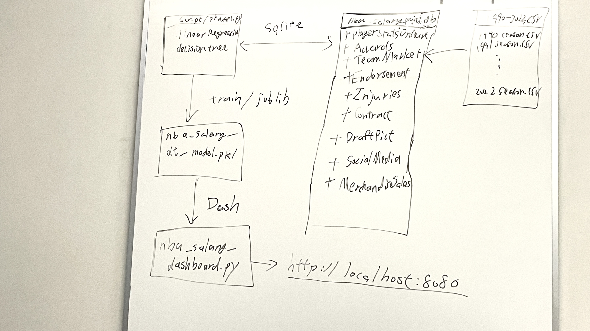

# nba-intelligent-salary-prdictor
📊 NBA Salary Optimization   🔍 Researching the correlation between player performance and salaries   🧠 Implementing predictive modeling, reinforcement learning, and robust control   📈 Goal: Build a data-driven framework for intelligent salary decision-making  


> **Phase 1 (Initial Demo)**  
> - Use on-court statistics only  
> - Import CSVs into a local SQLite database  
> - Build ERD & sketch system architecture  
> - Clean data & engineer features  
> - Train & serialize ML models (Linear Regression, Decision Tree)  
> - Serve predictions via a local Dash web app  

---

## 🎯 Project Goals

1. **Database (Phase 1)**  
   - Load ten seasons of `NBA Player Stats` and `NBA Salaries` CSV into SQLite  
   - Normalize into multiple tables (`PlayerStats`, `Contracts`, `Injuries`, …)  
   - Draw an Entity-Relationship Diagram (ERD) to show keys & relationships  

2. **ML & Feature Engineering**  
   - Clean, impute, drop outliers  
   - Create advanced on-court features (WEFF, UsageRate, PPG, RPG, …)  
   - Train baseline Linear Regression & Decision Tree models  
   - Evaluate with MSE, MAE, R², Mallows’ Cp  

3. **Web App (Phase 1 Demo)**  
   - Serialize best model to `nba_salary_model.pkl`  
   - Build a Dash app that:  
     1. Reads user inputs via sliders & dropdown  
     2. Loads the serialized model  
     3. Returns a salary prediction
    

## System Design 



## database ERD


## 🔧 Project Structure
```plain
nba-intelligent-salary/
├── db_setup.py             # Load CSV → SQLite tables  
├── scripts/
│   ├── phase1.py           # Data cleaning → feature engineering → train & save models  
│   └── db_queries.py       # Example SQL queries against SQLite  
├── models/
│   └── nba_salary_rf_model.pkl  
├── dash_app.py             # Dash web server (local)  
├── images/
│   ├── erd.png             # Entity-Relationship Diagram  
│   └── architecture.png    # System architecture sketch  
├── data/
│   ├── NBA_Player_Stats.csv
│   └── NBA_Salaries.csv
└── README.md
